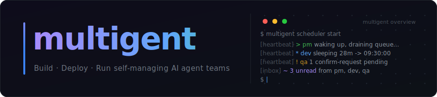

<p align="center">
  
</p>

<div align="center">

# Multigent

**Agent collaboration infrastructure for teams that want agents to actually deliver.**

Multigent helps teams turn prompts, tools, workflows, and human reviews into a coordinated agent workforce. Keep your existing project tools and chat tools; use Multigent as the control plane that gives agents shared context, structured tasks, safe execution, and observable handoffs.

[Documentation](docs/) · [Architecture](docs/agent-runtime-cli-architecture.md) · [Workflow Engine](docs/collaboration-workflow-state-machine.md) · [Roadmap](docs/roadmap.md)

</div>

---

## Why Multigent

Most teams already have docs, task boards, repos, chats, meetings, and local coding agents. The hard part is not creating another chat box. The hard part is making agents understand the same context, follow the same process, use the right tools, ask for review at the right moment, and continue work without a human synchronously driving every step.

Multigent is built around that operating model:

- **Shared agent context**: workspace, team, role, project, task, docs, skills, tools, and workflow state are managed in one place.
- **Agent-ready task execution**: tasks can bind to workflows, carry structured inputs and outputs, and move between agents and humans.
- **Human review without human blocking**: humans act as owners, reviewers, and process designers instead of being the mandatory runtime loop.
- **External tools as capabilities**: GitHub, Feishu/Lark, Slack, Linear-style project systems, web search, design tools, and other services are modeled as workspace tools that agents can use through controlled runtime adapters.
- **Observable agent work**: runs, chat sessions, workflow steps, task history, tokens, logs, and audit events are visible from the web console.
- **Sandbox-first execution**: agents run in isolated environments with explicit credentials and tool access instead of reading the whole workspace by default.

## Product Model

```text
Workspace
  -> Teams and roles
  -> Projects
  -> Agents and humans
  -> Tasks
  -> Workflows
  -> Docs, skills, model accounts, and external tools
```

Multigent does not try to replace every existing system on day one. A company can keep using Jira, Linear, Plane, Huly, GitHub, Feishu/Lark, Slack, local agent CLIs, and internal docs. Multigent provides the agent-native coordination layer across those systems.

<p align="center">
  
</p>

## Core Features

### Agent Workforce

Create agent teammates with a role, model account, CLI runtime, sandbox, skills, and external tool access. Agents can work through web chat, scheduled wakeups, tasks, and workflow steps.

### Workflow Engine

Design reusable workspace-level workflows on a visual board. A workflow defines steps, actors, required inputs, required outputs, review loops, branch conditions, and handoffs. Tasks can then choose a workflow and assign each actor to a human or an agent.

### Playbooks

Install opinionated collaboration packages that bundle teams, roles, skills, and workflows. Playbooks help new workspaces start with a proven process instead of an empty canvas.

### External Tools

Configure tools once at the workspace level and expose them to selected agents. Multigent is designed to support multiple access patterns: platform CLIs, MCP gateways, API keys, OAuth apps, and runtime materialization.

### Knowledge Base

Store and reference documents by doc ID. Agents can create and read docs through the runtime CLI so workflow outputs can point to durable knowledge instead of ephemeral chat text.

### Scheduling and Runs

Use task-triggered wakeups, heartbeat schedules, cron jobs, and manual wakeups. Run records capture status, runtime session IDs, token usage where available, logs, and workflow step outputs.

### RBAC and Audit

Workspace roles, project membership, task visibility, user invitations, and audit events are first-class concepts. Humans and agents are treated as principals with scoped permissions.

## Quick Start

### Install

macOS and Linux:

```bash
curl -fsSL https://raw.githubusercontent.com/multigent/multigent/main/scripts/install.sh | bash
multigent version
```

Homebrew:

```bash
brew install multigent/tap/multigent
```

Windows PowerShell:

```powershell
irm https://raw.githubusercontent.com/multigent/multigent/main/scripts/install.ps1 | iex
```

npm wrapper:

```bash
npm install -g @multigent/multigent
```

Docker self-host:

```bash
docker run --rm -p 27892:27892 \
  -v multigent-data:/data \
  -v /var/run/docker.sock:/var/run/docker.sock \
  ghcr.io/multigent/multigent:latest
```

Open `http://127.0.0.1:27892`.

### Prerequisites for Agent Runs

- Docker, for sandboxed agent execution

Multigent publishes the default multi-architecture runtime image at `ghcr.io/multigent/multigent/runtime-base:latest`. The image bundles the matching Linux `mga` runtime CLI; native macOS and Windows binaries are never mounted into Linux sandboxes. The published GHCR package is public and does not require `docker login`.

### Run the Web Console

The production-style command serves the API and embedded frontend from one binary:

```bash
multigent --dir ./data start --addr 127.0.0.1:27892 --open
```

For frontend development with Vite hot reload:

```bash
make build
./dist/multigent --dir ./data api serve --addr 127.0.0.1:27893
cd web
npm install
npm run dev
```

Open the Vite URL shown in the terminal, usually `http://127.0.0.1:27894`.

## First Journey

1. Register the first user.
2. Create a workspace.
3. Invite members or continue alone.
4. Create or install teams, roles, and playbooks.
5. Add a project.
6. Add agents to the project.
7. Configure model accounts and external tools.
8. Create a workflow or use a built-in workflow.
9. Create a task and bind it to the workflow.
10. Watch the task move between agents and humans, with structured outputs recorded at every step.

## Architecture

```text
┌─────────────────────────┐
│      Web Console        │
│  React + workflow UI    │
└───────────┬─────────────┘
            │ HTTP / SSE
┌───────────▼─────────────┐
│      Go API Server      │
│ auth, RBAC, tasks, docs │
│ workflows, tools, runs  │
└───────────┬─────────────┘
            │
┌───────────▼─────────────┐
│      Storage Layer      │
│ SQLite today, interface │
│ ready for other DBs     │
└───────────┬─────────────┘
            │
┌───────────▼─────────────┐
│   Runtime Materializer  │
│ sandbox, CLI, skills,   │
│ credentials, tools      │
└───────────┬─────────────┘
            │
┌───────────▼─────────────┐
│  Isolated Agent Runtime │
│ Codex, Claude Code,     │
│ Cursor, tool CLIs, MCP  │
└─────────────────────────┘
```

See the deeper design notes:

- [Agent runtime CLI architecture](docs/agent-runtime-cli-architecture.md)
- [Runtime toolchain architecture](docs/runtime-toolchain-architecture.md)
- [Agent isolation and permission architecture](docs/agent-isolation-and-permission-architecture.md)
- [SQLite storage architecture](docs/sqlite-storage-architecture.md)
- [External tool plugin protocol](docs/external-tool-plugin-protocol.md)
- [Configuration and logging](docs/configuration-and-logging.md)
- [Release and distribution](docs/release-distribution.md)

## Development

```bash
make test
make web
make build-go
```

Useful commands:

```bash
# Start API only
./dist/multigent --dir ./data api serve --addr 127.0.0.1:27893

# Start API + embedded web
./dist/multigent --dir ./data start --addr 127.0.0.1:27892

# Inspect worker/runtime configuration
./dist/multigent worker inspect
```

Configuration can be supplied through CLI flags, environment variables, or a TOML file. See [configuration and logging](docs/configuration-and-logging.md).

## Current Status

Multigent is under active product development. The repository already includes the web console, workspace model, users and invitations, teams and roles, agents, model accounts, external tools, tasks, workflow definitions, scheduler, sandbox runtime abstraction, docs, playbooks, and telemetry.

The near-term focus is making the end-to-end journey production-grade:

- smoother onboarding and example workspaces;
- stronger sandbox isolation and runtime materialization;
- richer workflow execution and visual observability;
- better external tool adapters;
- cleaner product packaging for self-hosted and commercial deployments.

## License

Multigent is source-available under the [PolyForm Noncommercial License 1.0.0](LICENSE).

Commercial use is not permitted without a separate written commercial license from the copyright holder.
